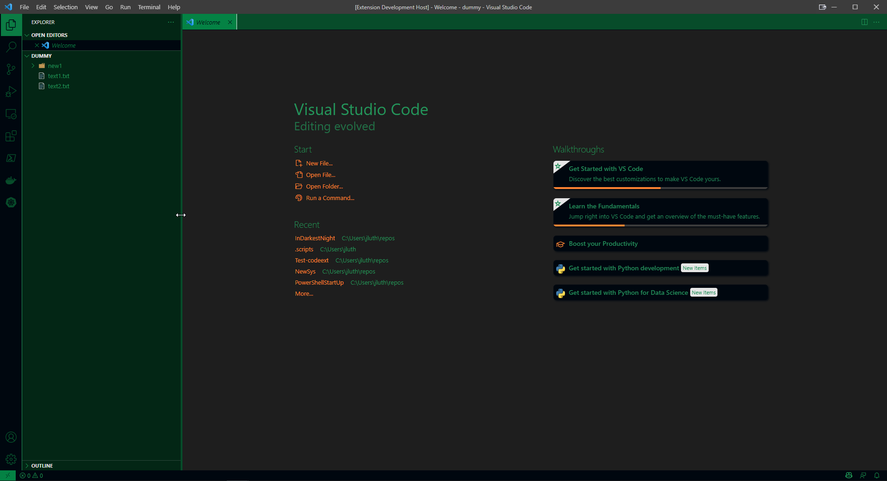

# In Darkest Night Theme

## Theme

 

# Installation

1. Open the **Extensions** sidebar in VS Code. `View → Extensions`
1. Search for `indarkestnight`, choose "In Darkest Night Theme" by **Jerky676**
1. Click **Install** to install it
1. Navigate to File > Preferences > Color Theme > **In Darkest Night Theme**

## Feedback

Please report issues related to this theme on the repository page. 

[GitHub Repository](/issues)

 

## License

This theme is released under the [Apache License](./license.md).